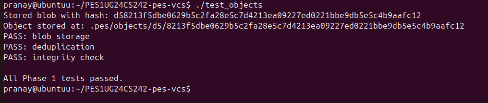
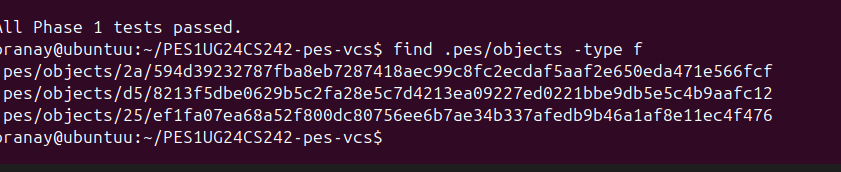
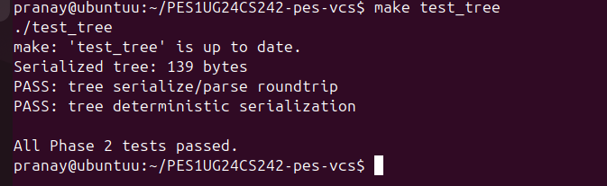
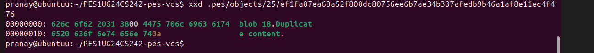
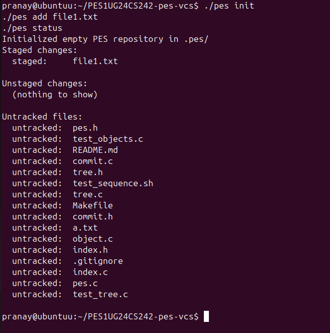
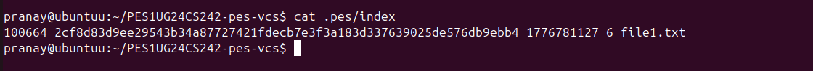
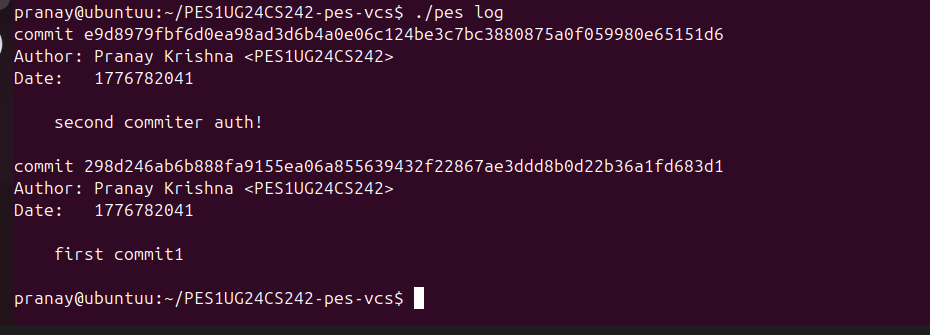
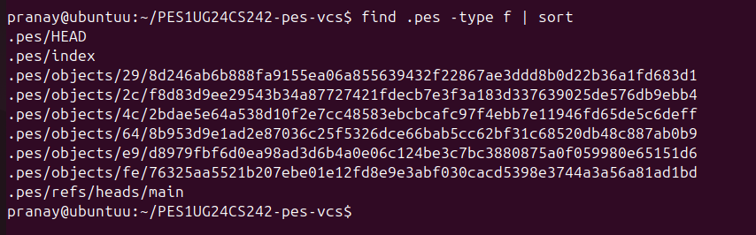
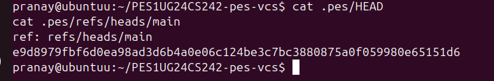

# PES Version Control System (Mini Git)

##  Overview
This project is a simplified version of a Git-like version control system implemented in C.  
It supports basic features like storing objects, staging files, creating commits, and viewing history.

---

##  Features Implemented

- Blob object storage (file content)
- Tree object creation (directory structure)
- Index (staging area)
- Commit creation and history tracking
- Log display

---

## Phases

---

### 🔹 Phase 1: Object Storage

- Implemented blob storage using SHA-256 hashing
- Stored objects in `.pes/objects`

####  Screenshots

  


---

### 🔹 Phase 2: Tree Objects

- Built directory structure from index
- Created tree objects linking blobs

####  Screenshots

  


---

### 🔹 Phase 3: Index (Staging Area)

- Implemented add, load, and save operations
- Tracks file metadata and hashes

####  Screenshots

  


---

### 🔹 Phase 4: Commit System

- Created commits with tree + parent linkage
- Updated HEAD pointer
- Implemented commit history (log)

####  Screenshots

  
  


---

## Phase 5: Branching & Checkout (Analysis)

### Q5.1
A branch in Git is a reference file that stores the latest commit hash. Implementing `pes checkout <branch>` involves updating the HEAD file to point to the selected branch in `.pes/refs/heads/`. The working directory must then be updated to match the tree of the target commit by adding, modifying, or deleting files. This operation is complex because it must keep the index, object store, and working directory consistent without losing data.

### Q5.2
To detect a "dirty working directory", we compare file metadata (like size and modification time) and hashes between the working directory and the index. If any tracked file differs, checkout should be refused to prevent data loss. This ensures uncommitted changes are not overwritten.

### Q5.3
In a detached HEAD state, HEAD points directly to a commit instead of a branch. Any new commits made are not referenced by a branch and may become unreachable. To recover them, the user must create a new branch pointing to those commits before they are lost.

---

##  Phase 6: Garbage Collection (Analysis)

### Q6.1
Garbage collection identifies unreachable objects by starting from all branch heads and traversing all reachable commits, trees, and blobs. A graph traversal algorithm like DFS or BFS can be used with a hash set to track visited objects. Unvisited objects are deleted. For a repository with 100,000 commits and 50 branches, only reachable objects are traversed, making the process efficient.

### Q6.2
Running garbage collection during a commit can cause race conditions where objects being created are mistakenly deleted. Git avoids this by using locking mechanisms and performing GC only when no active operations are modifying the object store.

---

##  How to Run

```bash
make clean
make

./pes init
echo "hello" > file.txt
./pes add file.txt
./pes commit -m "first commit"
./pes log
